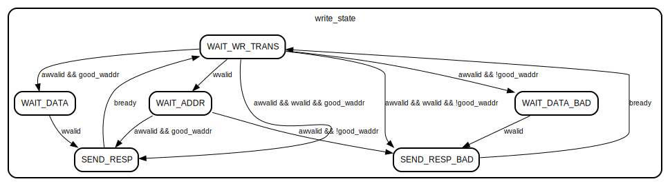
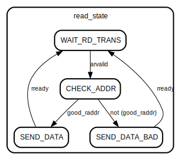

# Модуль: reg_control 

- **Файл**: reg_control.sv
## Диаграмма

## Описание

 Модуль, реализующий блок управления регистрами

 **РЕГИСТРЫ**

 Enable - регистр включения IP-ядра
 
 
 
 Value - входное значение для модулятора (от 8 до 16 бит)
 
 
 

## Порты

| Название | Направление | Тип            | Описание                        |
| -------- | ----------- | -------------- | ------------------------------- |
| aclk     | input       |                | тактовый сигнал                 |
| aresetn  | input       |                | сигнал сброса                   |
| enable   | output      |                | 0 - выкл, 1 - вкл.              |
| value    | output      | [31:0]         | входное значение для модулятора |
| awrite   | in          | bиртуальн шины |                                 |
| write    | in          | bиртуальн шины |                                 |
| bresp    | out         | bиртуальн шины |                                 |
| aread    | in          | bиртуальн шины |                                 |
| read     | out         | bиртуальн шины |                                 |
### Виртуальные шины

#### awrite

| Название | Направление | Тип    | Описание |
| -------- | ----------- | ------ | -------- |
| awaddr   | input       | [31:0] |          |
| awprot   | input       | [2:0]  |          |
| awvalid  | input       |        |          |
| awready  | output      |        |          |
#### write

| Название | Направление | Тип    | Описание |
| -------- | ----------- | ------ | -------- |
| wdata    | input       | [31:0] |          |
| wstrb    | input       | [3:0]  |          |
| wvalid   | input       |        |          |
| wready   | output      |        |          |
#### bresp

| Название | Направление | Тип   | Описание |
| -------- | ----------- | ----- | -------- |
| bresp    | output      | [1:0] |          |
| bvalid   | output      |       |          |
| bready   | input       |       |          |
#### aread

| Название | Направление | Тип    | Описание |
| -------- | ----------- | ------ | -------- |
| araddr   | input       | [31:0] |          |
| arprot   | input       | [2:0]  |          |
| arvalid  | input       |        |          |
| arready  | output      |        |          |
#### read

| Название | Направление | Тип    | Описание |
| -------- | ----------- | ------ | -------- |
| rdata    | output      | [31:0] |          |
| rresp    | output      | [1:0]  |          |
| rvalid   | output      |        |          |
| rready   | input       |        |          |
## Сигналы

| Название         | Тип                                                                                                                                                                                                                                                                                                         | Описание                                                    |
| ---------------- | ----------------------------------------------------------------------------------------------------------------------------------------------------------------------------------------------------------------------------------------------------------------------------------------------------------- | ----------------------------------------------------------- |
| regs_data        | logic [31:0]                                                                                                                                                                                                                                                                                                | массив значений регистров                                   |
| good_waddr       | logic                                                                                                                                                                                                                                                                                                       | флаг, пренадлежности адреса записи к пространству регистров |
| good_raddr       | logic                                                                                                                                                                                                                                                                                                       | флаг, пренадлежности адреса чтения к пространству регистров |
| waddr_reg        | logic [31:0]                                                                                                                                                                                                                                                                                                | внутренние регистры для адресов и данных                    |
| wdata_reg        | logic [31:0]                                                                                                                                                                                                                                                                                                | внутренние регистры для адресов и данных                    |
| raddr_reg        | logic [31:0]                                                                                                                                                                                                                                                                                                | внутренние регистры для адресов и данных                    |
| update_regs_data | logic                                                                                                                                                                                                                                                                                                       | флаги записи внутренних регистров                           |
| write_state      | enum { WAIT_WR_TRANS,  WAIT_ADDR,  WAIT_DATA,  SEND_RESP,  WAIT_DATA_BAD,  SEND_RESP_BAD} | состояния автомата записи                                   |
| read_state       | enum { WAIT_RD_TRANS,  CHECK_ADDR,  SEND_DATA,  SEND_DATA_BAD}                                                                                                  | состояния автомата чтения                                   |
## Константы

| Название  | Тип          | Значение  | Описание                 |
| --------- | ------------ | --------- | ------------------------ |
| regs_addr | logic [31:0] | undefined | массив адресов регистров |
## Процессы
- Check_Write_Addr: (  )
  - **Тип:** always_comb
  - **Описание**
  вычисление корректности адреса записи 
- Check_Read_Addr: (  )
  - **Тип:** always_comb
  - **Описание**
  вычисление корректности адреса чтения 
- Write_FSM: ( @(posedge aclk) )
  - **Тип:** always_ff
  - **Описание**
  конченый автомат записи данных (write_state)   WAIT_WR_TRANS - ожидание начала транзакции записи   WAIT_ADDR - данные получены, ожидание адреса   WAIT_DATA - получен корректный адрес, ожидание данных   WAIT_DATA_BAD - получен некорректный адрес, ожидание данных   SEND_RESP - успешная запись данных   SEND_RESP_BAD - неуспешная запись данных  
- Write_FSM_Outputs: (  )
  - **Тип:** always_comb
  - **Описание**
  выходные сигналы автомата записи (write_state)    
- Save_waddr_reg: ( @(posedge aclk) )
  - **Тип:** always_ff
  - **Описание**
  запись временного регистра адреса 
- Save_wdata_reg: ( @(posedge aclk) )
  - **Тип:** always_ff
  - **Описание**
  запись временного регистра данных 
- Updata_regs_data: ( @(posedge aclk) )
  - **Тип:** always_ff
  - **Описание**
  запись обновление регистров новыми данными 
- Read_FSM: ( @(posedge aclk) )
  - **Тип:** always_ff
  - **Описание**
  конченый автомат чтения данных (read_state)    WAIT_RD_TRANS - ожидание начала транзакции чтения   CHECK_ADDR - проверка корректности адреса   SEND_DATA - успешная выдача данных   SEND_DATA_BAD - неуспешная выдача данных  
- Read_FSM_Outputs: (  )
  - **Тип:** always_comb
  - **Описание**
  выходные сигналы автомата чтения (read_state)    
- Save_raddr_reg: ( @(posedge aclk) )
  - **Тип:** always_ff
  - **Описание**
  запись временного регистра адреса 
- Get_read_data: ( @(posedge aclk) )
  - **Тип:** always_ff
  - **Описание**
  получение считываемого значения 
## Конечные автоматы

- конченый автомат записи данных (write_state)

WAIT_WR_TRANS - ожидание начала транзакции записи

WAIT_ADDR - данные получены, ожидание адреса

WAIT_DATA - получен корректный адрес, ожидание данных

WAIT_DATA_BAD - получен некорректный адрес, ожидание данных

SEND_RESP - успешная запись данных

SEND_RESP_BAD - неуспешная запись данных- конченый автомат чтения данных (read_state)

WAIT_RD_TRANS - ожидание начала транзакции чтения

CHECK_ADDR - проверка корректности адреса

SEND_DATA - успешная выдача данных

SEND_DATA_BAD - неуспешная выдача данных