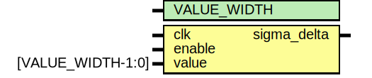

# Модуль: sigma_delta_core 

- **Файл**: sigma_delta_core.sv
## Диаграмма

## Описание

 Модуль, реализующий сигма-дельта модулятор 

## Параметры

| Название    | Тип | Значение | Описание                         |
| ----------- | --- | -------- | -------------------------------- |
| VALUE_WIDTH |     | 8        | ширина входных данных модулятора |
## Порты

| Название    | Направление | Тип               | Описание                    |
| ----------- | ----------- | ----------------- | --------------------------- |
| clk         | input       |                   | тактовый сигнал             |
| enable      | input       |                   | сигнал вкдючения модулятора |
| value       | input       | [VALUE_WIDTH-1:0] | входные данные модулятора   |
| sigma_delta | output      |                   | выходной сигнал             |
## Сигналы

| Название    | Тип                            | Описание          |
| ----------- | ------------------------------ | ----------------- |
| accum_value | logic signed [VALUE_WIDTH+1:0] | выход интегратора |
## Константы

| Название     | Тип               | Значение | Описание                              |
| ------------ | ----------------- | -------- | ------------------------------------- |
| ZEROS        | [VALUE_WIDTH-1:0] | '0       | нулевой значение                      |
| ONES         | [VALUE_WIDTH-1:0] | '1       | единичное значение                    |
| THRESH_VALUE | [VALUE_WIDTH-1:0] | ONES/2   | пороговое значение для блок сравнения |
## Процессы
- modulator: ( @(posedge clk) )
  - **Тип:** always_ff
  - **Описание**
  алгоритм работы модулятора 
- threshold: (  )
  - **Тип:** always_comb
  - **Описание**
  компоратор для формирования выходного сигнала 
